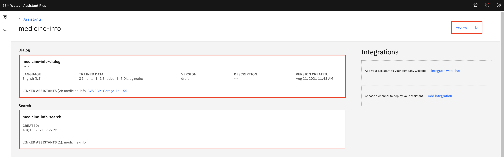

# Watson Assistant Chatbot Integration with Watson Discovery Service

In this repo, you are going to extend the Watson Assistant chatbot and add searching capability. Watson Discovery service serves as the content repository. The integration of Watson Assistant service and Watson Discovery service adds the searching capability to your chatbot. If the chatbot is not trained to cover end user inquiries, you may search the content repository and provide the next-best answer.


## Use Case Flow

At high level, the integration of Watson Assistant and Watson Discovery can be described like this

1. The documents are uploaded to the Watson Discovery, and annotated and pre-processed using its `Smart Document Understanding (SDU)` feature.
1. The user interacts with the backend server via the chatbot (or frontend app) that engages the user in a conversation.
1. Dialog between the user and backend server is coordinated using a Watson Assistant dialog/action skill.
1. If the user asks a question that the chatbot has not been trained, a search query is issued to the Watson Discovery service via a Watson Assistant search skill.
1. The end user is presented with the search result as the chatbot response.


## Included Components

* [IBM Watson Assistant](https://www.ibm.com/cloud/watson-assistant/): Build, test and deploy a bot or virtual agent across mobile devices, messaging platforms, or even on a physical robot.
* [IBM Watson Discovery](https://www.ibm.com/cloud/watson-discovery/): Find critical answers and insights from your business data using AI-powered enterprise search technology


## Exercise Flow

### Step 1 - Clone the Repository

The repo provides sample PDF files used by the Watson Discovery service alone with other information.

1. Open a `terminal` window on your local machine.

1. Navigate to a folder where you use to clone the repo.

1. Clone the repo

    ```
    git clone https://github.com/lee-zhg/waston-chatbot-discovery-integration
    ```

1. The sample PDF files locate in the `/data` sub-folder.


### Step 2 - Watson Discovery Service

In the use case, `Watson Discovery` service serves as a content repository. Enterprise data will be uploaded into the instance. The information is then annotated and pre-processed using the Discovery `Smart Document Understanding (SDU)` feature. Veriety document formats are supported by the Watson Discovery service. During this repo, sample PDF files are provided.


#### Step 2.1 - Deploying Watson Discovery Service

1. Login IBM Cloud.

1. Go to https://cloud.ibm.com/catalog/services/watson-discovery.

1. Create an instance of Watson Discovery service. Both `Lite` plan and paid plan support the repo.


#### Step 2.2 - Configure Watson Discovery Service and Upload Sample PDF Files

After an instance of Watson Discovery service is created, 

1. Select `Launch Watson Discovery` button on the `Manage` tab.

    

1. Select `New project` tile to create a new project.

    

1. Name your project. For example, `myproject`.

1. Select `Document Retrieval` option.

1. `Next`.

    

1. Select `Upload Data` tile.

1. `Next`.

    

1. In the `Collection name` field, enter `medicine-pdf`.

1. Optionally, select `Apply FAQ extraction`.

1. `Next`.

1. Select `Drag and drop files here or upload` link.

1. Select all three sample PDF files in the `/data` sub-folder in the repo directory.

1. `Finish`.

1. It may take couple of minutes to upload sample PDF files. Wait until the uploading completes.

1. Upon the uploading process completes, you are redirected to the following page.

    


#### Step 2.3 - Pre-process the Sample PDF Files

Use `Smart Document Understanding (SDU)` feature of Watson Discovery to break your documents into smaller, more consumable chunks of information. When you help Discovery index the correct set of information in your documents, you improve the answers that your application can find and return.

This repo does not cover how the `Smart Document Understanding (SDU)` works. The subject itself may need a separate repo or two. Detail information is available at [Smart Document Understanding](https://cloud.ibm.com/docs/discovery-data?topic=discovery-data-configuring-fields).

> Tips: to use the `Smart Document Understanding (SDU)` feature of Watson Discovery, you must select `User-trained models` for the collection. 


> Tips: mark section titles in the sample PDF files as `subtitle` and then `Split document on each occurrence of` `subtitle`. The practice likely enhances the search accuracy across the Discovery service.


#### Step 2.4 - Search Contents in Watson Discovery Service

It's the best practice to verify the search result and accuracy in `Watson Discovery Service` before moving forward.

1. Login to IBM Cloud.

1. Search and open the Watson Discovery instance.

1. Select `Launch Watson Discovery` button on the `Manage` tab.

1. In the `Launch Watson Discovery` window, select the right `project` and `collection`.

    

1. Select `Try it out` tile on the right.

    

1. Enter `aspirin dosage` in the `Search` field.

1. The result `Bayer Aspirin dose ranges from 50 mg to 6000 mg daily` should appear as the top search result.

    


### Step 3 - Watson Assistant Service

The integration of Watson Assistant service and Watson Discovery service is configured and deployed in `Watson Assistant Service` instance.


#### Step 3.1 - Create Search Skill

To create a `Search skill` in Watson Assistant instance,

1. Login to IBM Cloud.

1. Search and open the Watson Assistant instance.

1. Select `Launch Watson Assisatnt` button on the `Manage` tab.

1. Navigate to `Skill` tab.

1. Select `Create skill` button.

    

1. `Next`.

1. Enter `medicine-info-search` in the `Name` field.

1. `Continue`.

    

1. Select the correct `Watson Discovery` instance.

1. Select the correct `Project` and `Collection` of the `Watson Discovery` instance.

1. `Next`.

    

1. Select `title | Example: ......` in the `Title` field.

1. Select `text | Example: ......` in the `Body` field.

1. Select `footer | ......` in the `URL` field.

1. Optionally, enter `aspirin dosage` in the `Preview` section on the right. `Bayer Aspirin dose ranges from 50 mg to 6000 mg daily` appears as the top hit result.

    

1. `Create`.


#### Step 3.2 - Create Dialog Skill

While you are going to create a new `assistant` in the next section, you'll need a simple `dialog skill`.

A sample dialog skill `skill-medicine-info-dialog.json` is provided in sub-folder `data/`. You may quickly import the JSON file and create a dialog skill.


#### Step 3.3 - Create Assistant

To create a new `assistant`,

1. Navigate to the `Assistant` tab in the left pane.

1. Select `Create assistant`.

1. Enter `medicine-info` in the `Name` field.

1. `Create assistant`.

    

1. Click `Add an actions or dialog skill` link.

1. Select `medicine-info-dialog` tile.

1. Click `Add search skill` link.

1. Select `medicine-info-search` tile.

    


#### Step 3.4 - Verification

To verify the chatbot's search capability works as expected,

1. Select `Preview` button at the top-right corner.

1. Ask `what is aspirin dosage?`

1. `Bayer Aspirin dose ranges from 50 mg to 6000 mg daily` are retrieved from Watson Discovery service and sent back to end user as reply.

    


## License

This code pattern is licensed under the Apache Software License, Version 2.  Separate third party code objects invoked within this code pattern are licensed by their respective providers pursuant to their own separate licenses. Contributions are subject to the [Developer Certificate of Origin, Version 1.1 (DCO)](https://developercertificate.org/) and the [Apache Software License, Version 2](https://www.apache.org/licenses/LICENSE-2.0.txt).

[Apache Software License (ASL) FAQ](https://www.apache.org/foundation/license-faq.html#WhatDoesItMEAN)

## Links

* [Demo on youtube](https://youtu.be/6QlAnqSiWvo)
* [IBM Watson Assistant Docs](https://cloud.ibm.com/docs/services/conversation/dialog-build.html#dialog-build)
* [Blog for IBM Watson Assistant Slots Code Pattern](https://developer.ibm.com/code/2017/09/19/managing-resources-efficiently-watson-conversation-slots/)

## Learn more

* **Artificial Intelligence Code Patterns**: Enjoyed this Code Pattern? Check out our other [AI Code Patterns](https://developer.ibm.com/technologies/artificial-intelligence/).
* **AI and Data Code Pattern Playlist**: Bookmark our [playlist](https://www.youtube.com/playlist?list=PLzUbsvIyrNfknNewObx5N7uGZ5FKH0Fde) with all of our Code Pattern videos
* **With Watson**: Want to take your Watson app to the next level? Looking to utilize Watson Brand assets? [Join the With Watson program](https://www.ibm.com/watson/with-watson/) to leverage exclusive brand, marketing, and tech resources to amplify and accelerate your Watson embedded commercial solution.
* **Kubernetes on IBM Cloud**: Deliver your apps with the combined the power of [Kubernetes and Docker on IBM Cloud](https://www.ibm.com/cloud/container-service)
